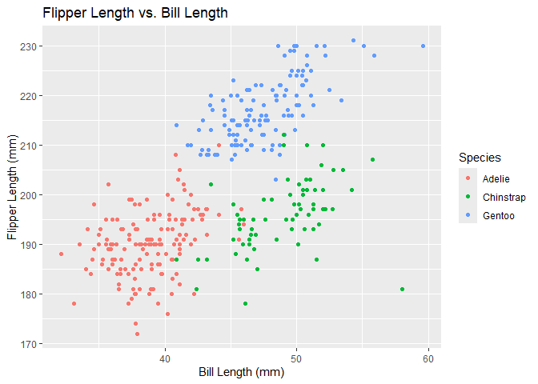

hw1_yx2857
================

**Problem 1**

The dataset, *penguins*, stores information of penguins, including
species, island, body measurements, sex, and year. The penguin dataset
has 8 columns and 344 rows.  
The mean flipper length is 200.92 mm.

<!-- -->

**Problem 2**  
Dataset “store” is created as follows:

    ## # A tibble: 10 × 4
    ##    balance good  staff manager
    ##      <dbl> <lgl> <chr> <fct>  
    ##  1  0.674  TRUE  a     a      
    ##  2  1.31   TRUE  b     b      
    ##  3  0.115  TRUE  c     c      
    ##  4  1.07   TRUE  d     a      
    ##  5  0.155  TRUE  e     b      
    ##  6  2.12   TRUE  f     c      
    ##  7 -0.219  FALSE g     a      
    ##  8 -0.113  FALSE h     b      
    ##  9 -0.0651 FALSE i     c      
    ## 10  0.476  TRUE  j     a

Try to take the mean of each variable in your dataframe. What works and
what doesn’t?

    ## # A tibble: 1 × 4
    ##   balance  good staff manager
    ##     <dbl> <dbl> <dbl>   <dbl>
    ## 1   0.552   0.7    NA      NA

Taking the mean works for the variable `balance` and `good`, but not for
the variable `staff` or `manager`.

``` r
# Write a code chunk that applies the as.numeric function to the logical, character, and factor variables (please show this chunk but not the output). What happens, and why? Does this help explain what happens when you try to take the mean?
store %>% pull(good) %>% as.numeric
store %>% pull(staff) %>% as.numeric
store %>% pull(manager) %>% as.numeric
```

When applying the `as.numeric` function to the logical, character, and
factor variables, the logical variable `good` is converted to 0 and 1,
the character variable `staff` is converted to `NA`, and the factor
variable `manager` is converted to the integer representation of the
factor levels. This helps explain what happens when trying to take the
mean of these variables. The `mean` function only works for numeric
variables, so it will not work for logical, character, or factor
variables.
